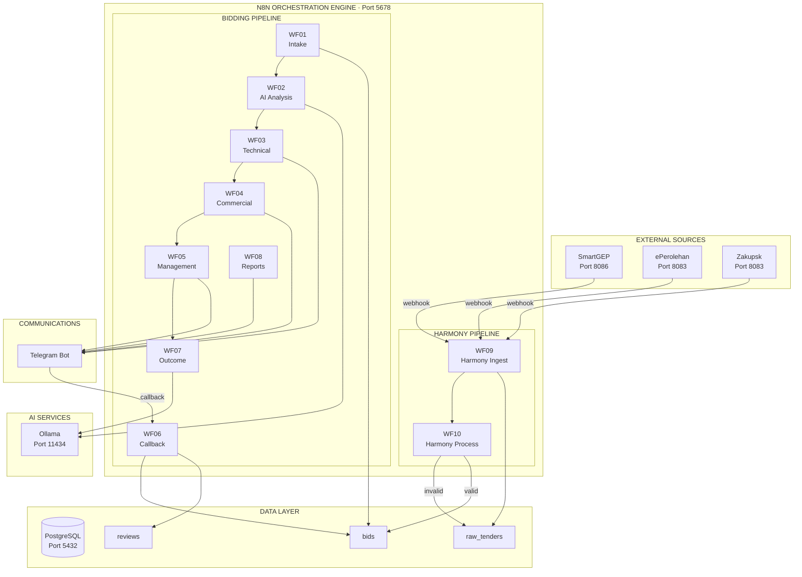

# TenderBiru System Architecture

> Last updated: 2026-02-03

## MONOCHROMATIC SYSTEM INFOGRAPHIC

```
╔══════════════════════════════════════════════════════════════════════════════════════════════════════════════╗
║                                                                                                              ║
║   T E N D E R B I R U   ·   H A R M O N Y   P I P E L I N E   ·   S Y S T E M   A R C H I T E C T U R E    ║
║                                                                                                              ║
╚══════════════════════════════════════════════════════════════════════════════════════════════════════════════╝


┌──────────────────────────────────────────────────────────────────────────────────────────────────────────────┐
│                                         E X T E R N A L   S O U R C E S                                      │
│                                                                                                              │
│    ┌─────────────────────┐      ┌─────────────────────┐      ┌─────────────────────┐                        │
│    │                     │      │                     │      │                     │                        │
│    │     S M A R T G E P │      │   e P E R O L E H A N      │     Z A K U P S K   │                        │
│    │     ───────────────│      │   ─────────────────│      │     ─────────────── │                        │
│    │                     │      │                     │      │                     │                        │
│    │  PETRONAS Tenders   │      │  Malaysian Govt    │      │  Kazakhstan Govt   │                        │
│    │  Port 8086          │      │  Port 8083         │      │  Port 8083         │                        │
│    │                     │      │                     │      │                     │                        │
│    └──────────┬──────────┘      └──────────┬──────────┘      └──────────┬──────────┘                        │
│               │                            │                            │                                    │
│               │    COMPLETION_WEBHOOK      │     notify_webhook         │     notify_webhook                │
│               │                            │                            │                                    │
│               └────────────────────────────┴────────────────────────────┘                                    │
│                                            │                                                                 │
│                                            ▼                                                                 │
│                              ┌─────────────────────────┐                                                     │
│                              │  POST /harmony/ingest   │                                                     │
│                              └─────────────────────────┘                                                     │
│                                                                                                              │
└──────────────────────────────────────────────────────────────────────────────────────────────────────────────┘
                                             │
                                             │
                                             ▼
┌──────────────────────────────────────────────────────────────────────────────────────────────────────────────┐
│                                                                                                              │
│                              N 8 N   O R C H E S T R A T I O N   E N G I N E                                │
│                                            Port 5678                                                         │
│                                                                                                              │
│  ┌ ─ ─ ─ ─ ─ ─ ─ ─ ─ ─ ─ ─ ─ ─ ─ ─ ─ ─ ─ ─ ─ ─ ─ ─ ─ ─ ─ ─ ─ ─ ─ ─ ─ ─ ─ ─ ─ ─ ─ ─ ─ ─ ─ ─ ─ ─ ─ ─ ─ ┐  │
│    HARMONY PIPELINE (Automated Ingestion)                                                                    │
│  │                                                                                                         │  │
│       ┌───────────────┐         ┌───────────────┐         ┌───────────────────────────────────┐              │
│  │    │               │         │               │         │                                   │           │  │
│       │    WF 09      │────────▶│    WF 10      │────────▶│         P O S T G R E S          │              │
│  │    │   ─────────   │         │   ─────────   │         │         ───────────────          │           │  │
│       │               │         │               │         │                                   │              │
│  │    │ Harmony       │         │ Harmony       │         │  ┌─────────────┐ ┌─────────────┐ │           │  │
│       │ Ingest        │         │ Process       │         │  │ raw_tenders │ │    bids     │ │              │
│  │    │               │         │               │         │  │ ─────────── │ │ ─────────── │ │           │  │
│       │ • Validate    │         │ • Normalize   │         │  │             │ │             │ │              │
│  │    │ • Store Raw   │         │ • Parse Date  │         │  │ source      │ │ reference   │ │           │  │
│       │ • Filter      │         │ • Validate    │         │  │ tender_id   │ │ title       │ │              │
│  │    │ • Trigger     │         │ • Branch      │         │  │ raw_data    │ │ client      │ │           │  │
│       │   WF10        │         │               │         │  │ status      │ │ deadline    │ │              │
│  │    │               │         │   ┌───────┐   │         │  │ bid_id ────────▶ id         │ │           │  │
│       └───────────────┘         │   │ Valid │   │         │  │ error_msg   │ │ status      │ │              │
│  │                              │   └───┬───┘   │         │  │             │ │ source      │ │           │  │
│                                 │       │       │         │  └─────────────┘ └─────────────┘ │              │
│  │                              │   ┌───┴───┐   │         │                                   │           │  │
│                                 │   ▼       ▼   │         └───────────────────────────────────┘              │
│  │                              │  YES      NO  │                                                          │  │
│                                 │   │       │   │                                                              │
│  │                              │   ▼       ▼   │                                                          │  │
│                                 │ DRAFT  invalid│                                                              │
│  │                              │  bid    status│                                                          │  │
│                                 └───────────────┘                                                              │
│  └ ─ ─ ─ ─ ─ ─ ─ ─ ─ ─ ─ ─ ─ ─ ─ ─ ─ ─ ─ ─ ─ ─ ─ ─ ─ ─ ─ ─ ─ ─ ─ ─ ─ ─ ─ ─ ─ ─ ─ ─ ─ ─ ─ ─ ─ ─ ─ ─ ─ ┘  │
│                                                                                                              │
│  ┌ ─ ─ ─ ─ ─ ─ ─ ─ ─ ─ ─ ─ ─ ─ ─ ─ ─ ─ ─ ─ ─ ─ ─ ─ ─ ─ ─ ─ ─ ─ ─ ─ ─ ─ ─ ─ ─ ─ ─ ─ ─ ─ ─ ─ ─ ─ ─ ─ ─ ┐  │
│    BIDDING PIPELINE (Human-in-the-Loop)                                                                      │
│  │                                                                                                         │  │
│                                                                                                              │
│  │  ┌─────────┐    ┌─────────┐    ┌─────────┐    ┌─────────┐    ┌─────────┐    ┌─────────┐    ┌─────────┐│  │
│     │         │    │         │    │         │    │         │    │         │    │         │    │         │   │
│  │  │  WF 01  │───▶│  WF 02  │───▶│  WF 03  │───▶│  WF 04  │───▶│  WF 05  │───▶│  WF 07  │───▶│  WF 08  ││  │
│     │ ─────── │    │ ─────── │    │ ─────── │    │ ─────── │    │ ─────── │    │ ─────── │    │ ─────── │   │
│  │  │         │    │         │    │         │    │         │    │         │    │         │    │         ││  │
│     │ Intake  │    │   AI    │    │Technical│    │Commercial    │Management    │ Outcome │    │ Reports │   │
│  │  │         │    │Analysis │    │ Review  │    │ Review  │    │ Approval│    │Tracking │    │  (CRON) ││  │
│     │         │    │         │    │         │    │         │    │         │    │         │    │         │   │
│  │  └─────────┘    └────┬────┘    └────┬────┘    └────┬────┘    └────┬────┘    └─────────┘    └─────────┘│  │
│                         │              │              │              │                                       │
│  │                      │              │              │              │                                     │  │
│                         │              └──────────────┴──────────────┘                                       │
│  │                      │                             │                                                    │  │
│                         │                             │                                                      │
│  │                      ▼                             ▼                                                    │  │
│                  ┌─────────────┐              ┌─────────────┐                                                 │
│  │               │             │              │             │                                              │  │
│                  │   OLLAMA    │              │  TELEGRAM   │                                                 │
│  │               │   ───────   │              │  ─────────  │                                              │  │
│                  │             │              │             │                                                 │
│  │               │ Port 11434  │              │   WF 06     │◀──────── Button Callbacks                    │  │
│                  │             │              │  Callback   │                                                 │
│  │               │ qwen3-coder │              │  Handler    │                                              │  │
│                  │ deepseek-ocr│              │             │                                                 │
│  │               │             │              │             │                                              │  │
│                  └─────────────┘              └─────────────┘                                                 │
│  │                                                                                                         │  │
│  └ ─ ─ ─ ─ ─ ─ ─ ─ ─ ─ ─ ─ ─ ─ ─ ─ ─ ─ ─ ─ ─ ─ ─ ─ ─ ─ ─ ─ ─ ─ ─ ─ ─ ─ ─ ─ ─ ─ ─ ─ ─ ─ ─ ─ ─ ─ ─ ─ ─ ┘  │
│                                                                                                              │
└──────────────────────────────────────────────────────────────────────────────────────────────────────────────┘


┌──────────────────────────────────────────────────────────────────────────────────────────────────────────────┐
│                                                                                                              │
│                                    D A T A   F L O W   D E T A I L                                          │
│                                                                                                              │
├──────────────────────────────────────────────────────────────────────────────────────────────────────────────┤
│                                                                                                              │
│   HARMONY PIPELINE                              BIDDING PIPELINE                                             │
│   ────────────────                              ────────────────                                             │
│                                                                                                              │
│   Scraper                                       Manual Entry                                                 │
│      │                                             │                                                         │
│      ▼                                             ▼                                                         │
│   ┌──────────┐                                  ┌──────────┐                                                 │
│   │ WF09     │                                  │ WF01     │                                                 │
│   │ Ingest   │                                  │ Intake   │                                                 │
│   └────┬─────┘                                  └────┬─────┘                                                 │
│        │                                             │                                                       │
│        ▼                                             ▼                                                       │
│   ┌──────────┐                                  ┌──────────┐                                                 │
│   │raw_tender│                                  │   bid    │───────────────────┐                             │
│   │ (pending)│                                  │(SUBMITTED)                   │                             │
│   └────┬─────┘                                  └────┬─────┘                   │                             │
│        │                                             │                         │                             │
│        ▼                                             ▼                         │                             │
│   ┌──────────┐                                  ┌──────────┐                   │                             │
│   │ WF10     │                                  │ WF02     │                   │                             │
│   │ Process  │                                  │ AI Anlys │                   │                             │
│   └────┬─────┘                                  └────┬─────┘                   │                             │
│        │                                             │                         │                             │
│   ┌────┴────┐                                   ┌────┴────┐                    │                             │
│   ▼         ▼                                   ▼         ▼                    │                             │
│ valid    invalid                            score≥70   score<70               │                             │
│   │         │                                   │         │                    │                             │
│   ▼         ▼                                   ▼         ▼                    │                             │
│ ┌────┐   ┌────┐                            ┌────────┐ ┌────────┐               │                             │
│ │bid │   │raw │                            │TECH    │ │NEEDS   │               │                             │
│ │DRFT│   │err │                            │REVIEW  │ │INFO    │               │                             │
│ └──┬─┘   └────┘                            └───┬────┘ └────────┘               │                             │
│    │                                           │                               │                             │
│    │                                           ▼                               │                             │
│    │                                      ┌──────────┐                         │                             │
│    │                                      │ WF03-05  │◀────────────────────────┘                             │
│    │                                      │ Reviews  │                                                       │
│    │                                      └────┬─────┘                                                       │
│    │                                           │                                                             │
│    │                                      ┌────┴────┐                                                        │
│    │                                      ▼         ▼                                                        │
│    │                                  approve    reject                                                      │
│    │                                      │         │                                                        │
│    │                                      ▼         ▼                                                        │
│    │                                 ┌────────┐ ┌────────┐                                                   │
│    │                                 │APPROVED│ │REJECTED│                                                   │
│    │                                 │TO_SUBMIT └────────┘                                                   │
│    │                                 └───┬────┘                                                              │
│    │                                     │                                                                   │
│    │                                     ▼                                                                   │
│    │                                ┌──────────┐                                                             │
│    │                                │ WF07     │                                                             │
│    │                                │ Outcome  │                                                             │
│    │                                └────┬─────┘                                                             │
│    │                                     │                                                                   │
│    │                                ┌────┴────┐                                                              │
│    │                                ▼    ▼    ▼                                                              │
│    │                              WON  LOST  N/A                                                             │
│    │                                │                                                                        │
│    │                                ▼                                                                        │
│    │                          ┌──────────┐                                                                   │
│    └─────────────────────────▶│ lessons  │                                                                   │
│                               │ learned  │                                                                   │
│                               └──────────┘                                                                   │
│                                                                                                              │
└──────────────────────────────────────────────────────────────────────────────────────────────────────────────┘


┌──────────────────────────────────────────────────────────────────────────────────────────────────────────────┐
│                                                                                                              │
│                               C O M P O N E N T   R E G I S T R Y                                           │
│                                                                                                              │
├───────────────────────┬──────────┬─────────────────────────────────────────────────────────────────────────┤
│ COMPONENT             │ PORT     │ FUNCTION                                                                 │
├───────────────────────┼──────────┼─────────────────────────────────────────────────────────────────────────┤
│                       │          │                                                                          │
│ n8n Orchestrator      │ 5678     │ Workflow engine, webhook endpoints, CRON scheduling                     │
│                       │          │                                                                          │
├───────────────────────┼──────────┼─────────────────────────────────────────────────────────────────────────┤
│                       │          │                                                                          │
│ PostgreSQL            │ 5432     │ tenderbiru (bids, reviews, audit)                                       │
│                       │          │ alumist_n8n.n8n.* (workflow definitions)                                │
│                       │          │                                                                          │
├───────────────────────┼──────────┼─────────────────────────────────────────────────────────────────────────┤
│                       │          │                                                                          │
│ Ollama                │ 11434    │ qwen3-coder:30b (analysis), deepseek-ocr (documents)                    │
│                       │          │                                                                          │
├───────────────────────┼──────────┼─────────────────────────────────────────────────────────────────────────┤
│                       │          │                                                                          │
│ SmartGEP Scraper      │ 8086     │ PETRONAS tender extraction, session-based auth                          │
│                       │          │                                                                          │
├───────────────────────┼──────────┼─────────────────────────────────────────────────────────────────────────┤
│                       │          │                                                                          │
│ ePerolehan Scraper    │ 8083     │ Malaysian government tenders, Cloudflare bypass                         │
│                       │          │                                                                          │
├───────────────────────┼──────────┼─────────────────────────────────────────────────────────────────────────┤
│                       │          │                                                                          │
│ Zakupsk Scraper       │ 8083     │ Kazakhstan government tenders, pagination support                       │
│                       │          │                                                                          │
├───────────────────────┼──────────┼─────────────────────────────────────────────────────────────────────────┤
│                       │          │                                                                          │
│ Telegram Bot          │ External │ Notifications, inline buttons, callback handling                        │
│                       │          │                                                                          │
└───────────────────────┴──────────┴─────────────────────────────────────────────────────────────────────────┘


┌──────────────────────────────────────────────────────────────────────────────────────────────────────────────┐
│                                                                                                              │
│                                W O R K F L O W   M A T R I X                                                │
│                                                                                                              │
├──────┬────────────────────┬─────────────────────────┬───────────────────────┬───────────────────────────────┤
│  ID  │ NAME               │ TRIGGER                 │ INPUT                 │ OUTPUT                        │
├──────┼────────────────────┼─────────────────────────┼───────────────────────┼───────────────────────────────┤
│      │                    │                         │                       │                               │
│ WF01 │ Bid Intake         │ POST /bid/submit        │ title, client, value  │ bid.id, audit_log             │
│      │                    │                         │                       │                               │
├──────┼────────────────────┼─────────────────────────┼───────────────────────┼───────────────────────────────┤
│      │                    │                         │                       │                               │
│ WF02 │ AI Analysis        │ HTTP from WF01          │ bid_id                │ scores, next_stage            │
│      │                    │                         │                       │                               │
├──────┼────────────────────┼─────────────────────────┼───────────────────────┼───────────────────────────────┤
│      │                    │                         │                       │                               │
│ WF03 │ Technical Review   │ HTTP from WF02          │ bid_id                │ telegram_msg, review          │
│      │                    │                         │                       │                               │
├──────┼────────────────────┼─────────────────────────┼───────────────────────┼───────────────────────────────┤
│      │                    │                         │                       │                               │
│ WF04 │ Commercial Review  │ HTTP from WF03          │ bid_id                │ telegram_msg, review          │
│      │                    │                         │                       │                               │
├──────┼────────────────────┼─────────────────────────┼───────────────────────┼───────────────────────────────┤
│      │                    │                         │                       │                               │
│ WF05 │ Mgmt Approval      │ HTTP from WF04          │ bid_id                │ telegram_msg, final_decision  │
│      │                    │                         │                       │                               │
├──────┼────────────────────┼─────────────────────────┼───────────────────────┼───────────────────────────────┤
│      │                    │                         │                       │                               │
│ WF06 │ Callback Handler   │ Telegram button         │ callback_data         │ decision, audit_log           │
│      │                    │                         │                       │                               │
├──────┼────────────────────┼─────────────────────────┼───────────────────────┼───────────────────────────────┤
│      │                    │                         │                       │                               │
│ WF07 │ Outcome Tracking   │ POST /bid/outcome       │ bid_id, outcome       │ lessons_learned               │
│      │                    │                         │                       │                               │
├──────┼────────────────────┼─────────────────────────┼───────────────────────┼───────────────────────────────┤
│      │                    │                         │                       │                               │
│ WF08 │ Scheduled Reports  │ CRON daily/weekly       │ (none)                │ telegram_reports              │
│      │                    │                         │                       │                               │
├──────┼────────────────────┼─────────────────────────┼───────────────────────┼───────────────────────────────┤
│      │                    │                         │                       │                               │
│ WF09 │ Harmony Ingest     │ POST /harmony/ingest    │ source, tenders[]     │ raw_tenders.pending           │
│      │                    │                         │                       │                               │
├──────┼────────────────────┼─────────────────────────┼───────────────────────┼───────────────────────────────┤
│      │                    │                         │                       │                               │
│ WF10 │ Harmony Process    │ HTTP from WF09          │ raw_tender_id         │ bid.DRAFT or error            │
│      │                    │                         │                       │                               │
└──────┴────────────────────┴─────────────────────────┴───────────────────────┴───────────────────────────────┘


┌──────────────────────────────────────────────────────────────────────────────────────────────────────────────┐
│                                                                                                              │
│                           B I D   S T A T U S   S T A T E   M A C H I N E                                   │
│                                                                                                              │
├──────────────────────────────────────────────────────────────────────────────────────────────────────────────┤
│                                                                                                              │
│                                                                                                              │
│                          ┌───────────────────────────────────────────────────┐                              │
│                          │                                                   │                              │
│                          ▼                                                   │                              │
│     ┌─────────┐     ┌─────────┐     ┌─────────┐     ┌─────────┐     ┌───────┴─┐                             │
│     │         │     │         │     │         │     │         │     │         │                             │
│     │  DRAFT  │────▶│SUBMITTED│────▶│TECHNICAL│────▶│COMMERCL │────▶│  MGMT   │                             │
│     │         │     │         │     │ REVIEW  │     │ REVIEW  │     │APPROVAL │                             │
│     └─────────┘     └────┬────┘     └────┬────┘     └────┬────┘     └────┬────┘                             │
│          │               │               │               │               │                                   │
│          │               │               │               │               │                                   │
│          │               ▼               ▼               ▼               ▼                                   │
│          │          ┌─────────┐     ┌─────────┐     ┌─────────┐     ┌─────────┐                             │
│          │          │ NEEDS   │     │TECH     │     │COMM     │     │APPROVED │                             │
│          │          │ INFO    │     │REJECTED │     │REJECTED │     │TO_SUBMIT│                             │
│          │          └─────────┘     └─────────┘     └─────────┘     └────┬────┘                             │
│          │               │                                               │                                   │
│          │               │                                               │                                   │
│          │               └───────────────────────────────────────────────┤                                   │
│          │                                                               │                                   │
│          │                                                               ▼                                   │
│          │                                                          ┌─────────┐                             │
│          │                                                          │SUBMITTED│                             │
│          │                                                          │TO_CLIENT│                             │
│          │                                                          └────┬────┘                             │
│          │                                                               │                                   │
│          │                                                          ┌────┴────┬────────┐                    │
│          │                                                          ▼         ▼        ▼                    │
│          │                                                     ┌───────┐ ┌───────┐ ┌───────┐                │
│          │                                                     │  WON  │ │ LOST  │ │  N/A  │                │
│          │                                                     └───┬───┘ └───┬───┘ └───┬───┘                │
│          │                                                         │         │         │                    │
│          │                                                         └─────────┴─────────┘                    │
│          │                                                                   │                              │
│          │                                                                   ▼                              │
│          │                                                             ┌───────────┐                        │
│          └────────────────────────────────────────────────────────────▶│  LESSONS  │                        │
│                              (via Harmony Pipeline)                    │  LEARNED  │                        │
│                                                                        └─────┬─────┘                        │
│                                                                              │                              │
│                                                                              ▼                              │
│                                                                        ┌───────────┐                        │
│                                                                        │ ARCHIVED  │                        │
│                                                                        └───────────┘                        │
│                                                                                                              │
└──────────────────────────────────────────────────────────────────────────────────────────────────────────────┘


┌──────────────────────────────────────────────────────────────────────────────────────────────────────────────┐
│                                                                                                              │
│                              D A T A B A S E   S C H E M A                                                  │
│                                                                                                              │
├──────────────────────────────────────────────────────────────────────────────────────────────────────────────┤
│                                                                                                              │
│                                                                                                              │
│    ┌─────────────────────┐          ┌─────────────────────┐          ┌─────────────────────┐                │
│    │                     │          │                     │          │                     │                │
│    │    raw_tenders      │          │       bids          │          │     reviews         │                │
│    │    ───────────      │          │       ────          │          │     ───────         │                │
│    │                     │          │                     │          │                     │                │
│    │  id             PK  │          │  id             PK  │◀─────────│  bid_id         FK  │                │
│    │  source             │          │  reference_number   │          │  review_type        │                │
│    │  source_tender_id   │          │  title              │          │  assigned_to    FK ─┼──┐             │
│    │  raw_data      JSON │          │  client_name        │          │  decision           │  │             │
│    │  status             │          │  submission_deadline│          │  decision_reason    │  │             │
│    │  bid_id         FK ─┼─────────▶│  estimated_value    │          │  due_at             │  │             │
│    │  error_message      │          │  status             │          │  sla_breached       │  │             │
│    │  processed_at       │          │  source             │          │  notification_msg_id│  │             │
│    │                     │          │  completeness_score │          │                     │  │             │
│    └─────────────────────┘          │  win_prob_score     │          └─────────────────────┘  │             │
│                                     │  risk_score         │                                   │             │
│                                     │                     │          ┌─────────────────────┐  │             │
│                                     └─────────────────────┘          │                     │  │             │
│                                                │                     │    reviewers        │  │             │
│                                                │                     │    ─────────        │◀─┘             │
│    ┌─────────────────────┐                     │                     │                     │                │
│    │                     │                     │                     │  id             PK  │                │
│    │   audit_log         │◀────────────────────┘                     │  telegram_chat_id   │                │
│    │   ─────────         │                                           │  name               │                │
│    │                     │                                           │  email              │                │
│    │  entity_type        │          ┌─────────────────────┐          │  can_review_tech    │                │
│    │  entity_id          │          │                     │          │  can_review_comm    │                │
│    │  action             │          │  lessons_learned    │          │  can_approve_mgmt   │                │
│    │  actor_type         │          │  ───────────────    │          │                     │                │
│    │  old_value          │          │                     │          └─────────────────────┘                │
│    │  new_value          │          │  bid_id         FK  │                                                 │
│    │  workflow_exec_id   │          │  outcome            │          ┌─────────────────────┐                │
│    │  source             │          │  key_factors        │          │                     │                │
│    │                     │          │  what_worked        │          │ conversation_state  │                │
│    └─────────────────────┘          │  improvements       │          │ ──────────────────  │                │
│                                     │  ai_analysis        │          │                     │                │
│                                     │  verified_by        │          │  chat_id            │                │
│    ┌─────────────────────┐          │                     │          │  user_id            │                │
│    │                     │          └─────────────────────┘          │  state_type         │                │
│    │   bid_analytics     │                                           │  context_json  JSON │                │
│    │   ─────────────     │          ┌─────────────────────┐          │  expires_at         │                │
│    │                     │          │                     │          │                     │                │
│    │  period_type        │          │  reviewer_metrics   │          └─────────────────────┘                │
│    │  period_start       │          │  ────────────────   │                                                 │
│    │  total_bids         │          │                     │                                                 │
│    │  bids_won           │          │  reviewer_id    FK  │                                                 │
│    │  bids_lost          │          │  period_type        │                                                 │
│    │  win_rate           │          │  reviews_assigned   │                                                 │
│    │  avg_completeness   │          │  reviews_completed  │                                                 │
│    │  reviewer_stats JSON│          │  avg_response_time  │                                                 │
│    │  client_stats  JSON │          │  sla_compliance     │                                                 │
│    │                     │          │  prediction_accuracy│                                                 │
│    └─────────────────────┘          │                     │                                                 │
│                                     └─────────────────────┘                                                 │
│                                                                                                              │
└──────────────────────────────────────────────────────────────────────────────────────────────────────────────┘


┌──────────────────────────────────────────────────────────────────────────────────────────────────────────────┐
│                                                                                                              │
│                              T E L E G R A M   I N T E G R A T I O N                                        │
│                                                                                                              │
├──────────────────────────────────────────────────────────────────────────────────────────────────────────────┤
│                                                                                                              │
│                                                                                                              │
│           INTAKE GROUP                ESCALATION GROUP                WINS CHANNEL                          │
│          ─────────────               ─────────────────               ─────────────                          │
│                                                                                                              │
│    ┌───────────────────────┐    ┌───────────────────────┐    ┌───────────────────────┐                      │
│    │                       │    │                       │    │                       │                      │
│    │   New Bid Submitted   │    │    SLA Breach Alert   │    │    Bid Won Report     │                      │
│    │                       │    │                       │    │                       │                      │
│    │   ─────────────────   │    │   ─────────────────   │    │   ─────────────────   │                      │
│    │                       │    │                       │    │                       │                      │
│    │   BID-2026-1234       │    │   URGENT: Review      │    │   CONTRACT AWARDED    │                      │
│    │   Client: PETRONAS    │    │   overdue by 4h       │    │                       │                      │
│    │   Value: RM 500,000   │    │                       │    │   BID-2026-1234       │                      │
│    │   Deadline: 15/03/26  │    │   Bid: BID-2026-999   │    │   Value: RM 500,000   │                      │
│    │                       │    │   Stage: Technical    │    │                       │                      │
│    │                       │    │   Assigned: @user     │    │   Key Factors:        │                      │
│    │   [View Details]      │    │                       │    │   - Competitive price │                      │
│    │                       │    │   [Escalate] [Extend] │    │   - Strong proposal   │                      │
│    │                       │    │                       │    │                       │                      │
│    └───────────────────────┘    └───────────────────────┘    └───────────────────────┘                      │
│                                                                                                              │
│                                                                                                              │
│                           REVIEW NOTIFICATION (sent to assigned reviewer)                                   │
│                          ─────────────────────────────────────────────────                                  │
│                                                                                                              │
│                          ┌─────────────────────────────────────────────┐                                    │
│                          │                                             │                                    │
│                          │   TECHNICAL REVIEW REQUIRED                 │                                    │
│                          │                                             │                                    │
│                          │   ───────────────────────────               │                                    │
│                          │                                             │                                    │
│                          │   BID-2026-1234                             │                                    │
│                          │   Client: PETRONAS                          │                                    │
│                          │   Value: RM 500,000                         │                                    │
│                          │                                             │                                    │
│                          │   AI Scores:                                │                                    │
│                          │   Completeness: 85%                         │                                    │
│                          │   Win Probability: 72%                      │                                    │
│                          │   Risk Score: 25%                           │                                    │
│                          │                                             │                                    │
│                          │   Due: 2026-02-05 14:00                     │                                    │
│                          │                                             │                                    │
│                          │   ┌──────────┐ ┌──────────┐ ┌──────────┐   │                                    │
│                          │   │ APPROVE  │ │ REVISION │ │  REJECT  │   │                                    │
│                          │   └──────────┘ └──────────┘ └──────────┘   │                                    │
│                          │                                             │                                    │
│                          └─────────────────────────────────────────────┘                                    │
│                                           │                                                                 │
│                                           │ User clicks button                                              │
│                                           ▼                                                                 │
│                                    ┌─────────────┐                                                          │
│                                    │             │                                                          │
│                                    │    WF06     │                                                          │
│                                    │  Callback   │                                                          │
│                                    │  Handler    │                                                          │
│                                    │             │                                                          │
│                                    └─────────────┘                                                          │
│                                                                                                              │
└──────────────────────────────────────────────────────────────────────────────────────────────────────────────┘


┌──────────────────────────────────────────────────────────────────────────────────────────────────────────────┐
│                                                                                                              │
│                                         S Y S T E M   S U M M A R Y                                         │
│                                                                                                              │
├────────────────────────────────────┬─────────────────────────────────────────────────────────────────────────┤
│                                    │                                                                         │
│  TOTAL WORKFLOWS                   │  10                                                                     │
│                                    │                                                                         │
├────────────────────────────────────┼─────────────────────────────────────────────────────────────────────────┤
│                                    │                                                                         │
│  TOTAL DATABASE TABLES             │  12 (bids, reviews, raw_tenders, audit_log, etc.)                      │
│                                    │                                                                         │
├────────────────────────────────────┼─────────────────────────────────────────────────────────────────────────┤
│                                    │                                                                         │
│  EXTERNAL SCRAPERS                 │  3 (SmartGEP, ePerolehan, Zakupsk)                                      │
│                                    │                                                                         │
├────────────────────────────────────┼─────────────────────────────────────────────────────────────────────────┤
│                                    │                                                                         │
│  AI MODELS                         │  2 (qwen3-coder:30b, deepseek-ocr)                                      │
│                                    │                                                                         │
├────────────────────────────────────┼─────────────────────────────────────────────────────────────────────────┤
│                                    │                                                                         │
│  HUMAN REVIEW GATES                │  3 (Technical, Commercial, Management)                                  │
│                                    │                                                                         │
├────────────────────────────────────┼─────────────────────────────────────────────────────────────────────────┤
│                                    │                                                                         │
│  SLA TRACKING                      │  Yes (48h/48h/24h by stage)                                             │
│                                    │                                                                         │
├────────────────────────────────────┼─────────────────────────────────────────────────────────────────────────┤
│                                    │                                                                         │
│  AUDIT TRAIL                       │  Complete (all state changes logged)                                    │
│                                    │                                                                         │
├────────────────────────────────────┼─────────────────────────────────────────────────────────────────────────┤
│                                    │                                                                         │
│  VPS HOST                          │  45.159.230.42:1511 (SSH)                                               │
│                                    │                                                                         │
└────────────────────────────────────┴─────────────────────────────────────────────────────────────────────────┘


                                                   ═══════════════════
                                                    END OF INFOGRAPHIC
                                                   ═══════════════════

```

---

## MERMAID DIAGRAM (Alternative Rendering)

For systems that support Mermaid rendering:



---

## Quick Reference

| Component | Port | Purpose |
|-----------|------|---------|
| n8n | 5678 | Workflow orchestration |
| PostgreSQL | 5432 | Data storage |
| Ollama | 11434 | AI analysis |
| SmartGEP | 8086 | PETRONAS scraper |
| ePerolehan/Zakupsk | 8083 | Govt tender scrapers |

| Workflow | Trigger | Function |
|----------|---------|----------|
| WF01 | POST /bid/submit | Manual bid intake |
| WF02 | HTTP | AI scoring |
| WF03-05 | HTTP | Human reviews |
| WF06 | Telegram callback | Button handling |
| WF07 | POST /bid/outcome | Outcome tracking |
| WF08 | CRON | Scheduled reports |
| WF09 | POST /harmony/ingest | Scraper intake |
| WF10 | HTTP | Tender processing |
